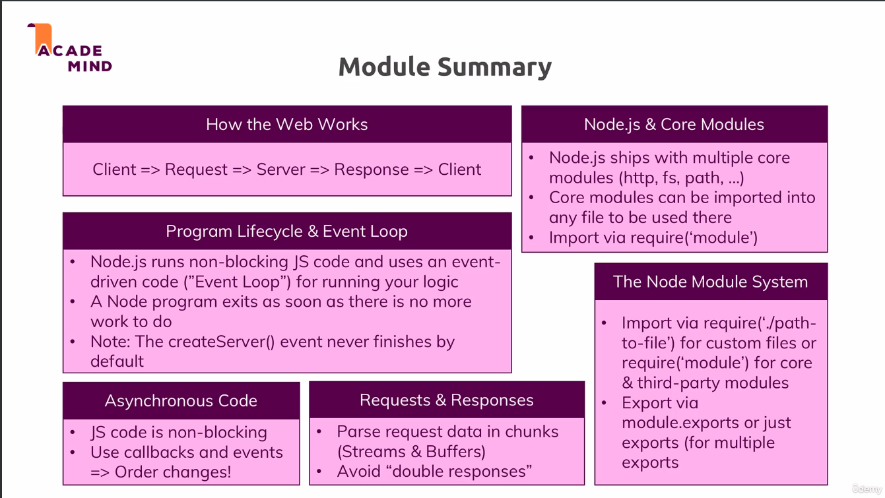
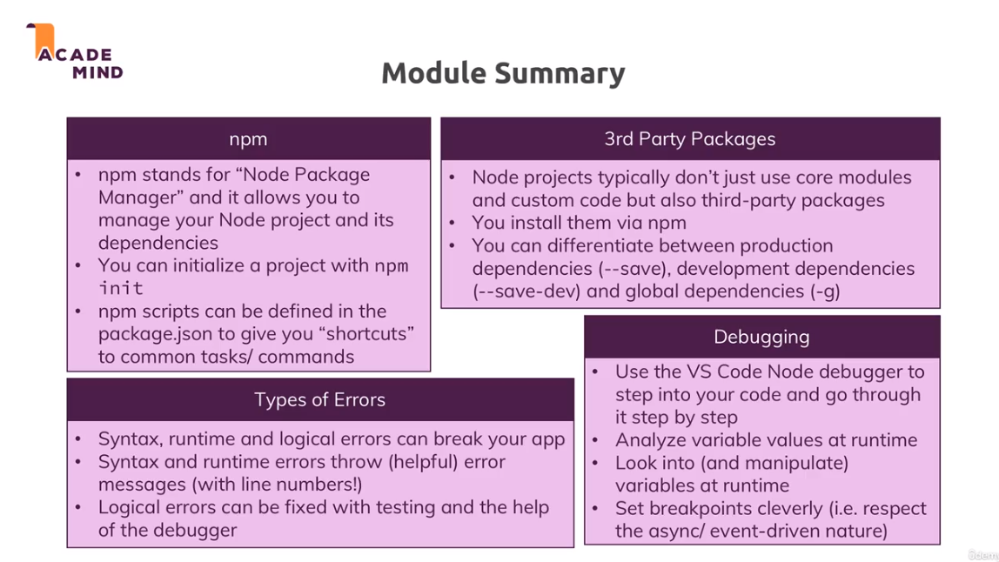
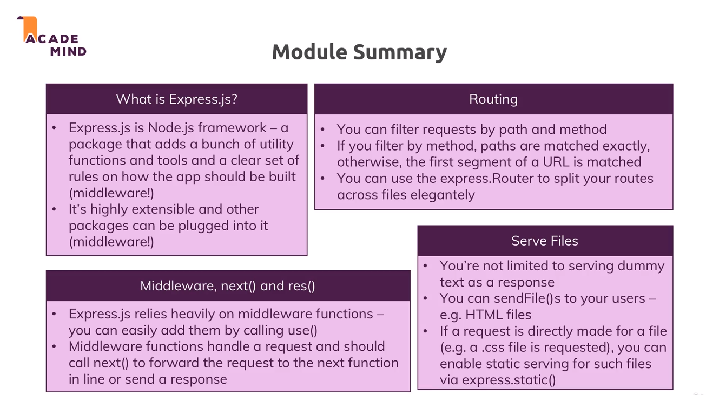

# NodeJs

Uses a single Javascript thread.

**How is it handle multiple requests?**

Event Loop -> started by NodeJs when program starts
Responsible for handling(executing) event callbacks


Worker Pool -> Do the heavy lifting
Runs on different threads, detached from JS code
Ex. accessing Filesystem
After fs operation is done, it triggers callback. Event loop handles(executes) this callback.

## Event Loop

At each iteration of event loop the callbacks are executed in this order.

1. Timers -> setTimeout(), setInterval() callbacks
2. Pending callback -> Execute I/O related callbacks that were deferred. (If there are too many, it postpones and moves on and executes them in next iteration)
3. Poll -> Retrieve new I/O events, execute their callbacks. If not possible, move them to pending.After this may jump to timer callbacks. 
4. Check -> setImmediate() callbacks
5. Close Callbacks -> all 'close' events callbacks.
6. process.exit() if refs == 0, refs is the callback and future work count.

Note: In a server, we always have a request listener and refs is never 0, so server listens indefinitely.



## NPM
Create package.json
```
npm init
```

Adding script to package.json
```
"scripts":{
    "start": "node app.js" // start is a special script
    "start-server": "node app.js" // start-server is a custom script
}
```
To run a special/known script
```
npm <script_name>
eg. npm start
```
To run a custom script
```
npm run <script_name>
eg. npm run start-server
```

To install development dependencies
```
npm install nodemon --save-dev
```

## Types of errors

1. Syntax errors
2. Runtime errors
3. Logical errors - no error message




# Express.js Framework
